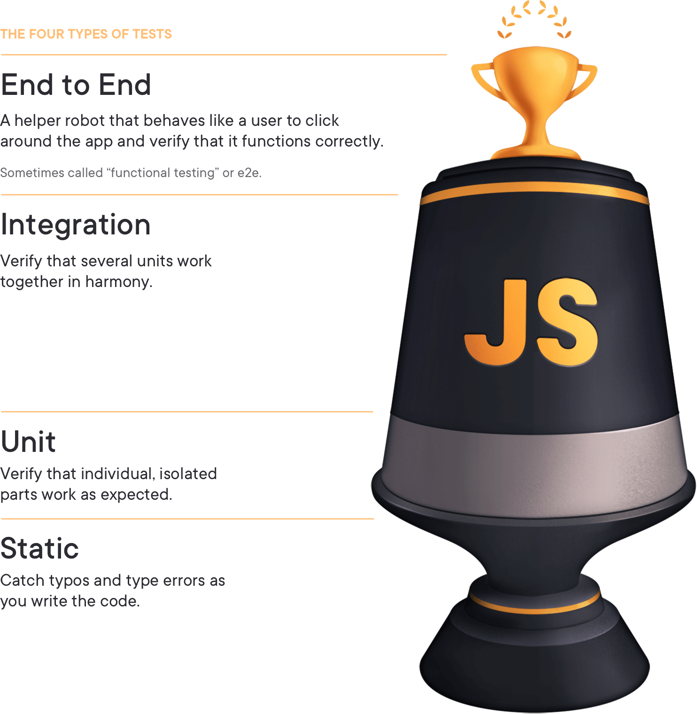

# Testing in JavaScript

#### Learning the smart, efficient way to test any JavaScript application.

--- 

### Reference 
[https://jestjs.io/docs/getting-started](https://jestjs.io/docs/getting-started)
